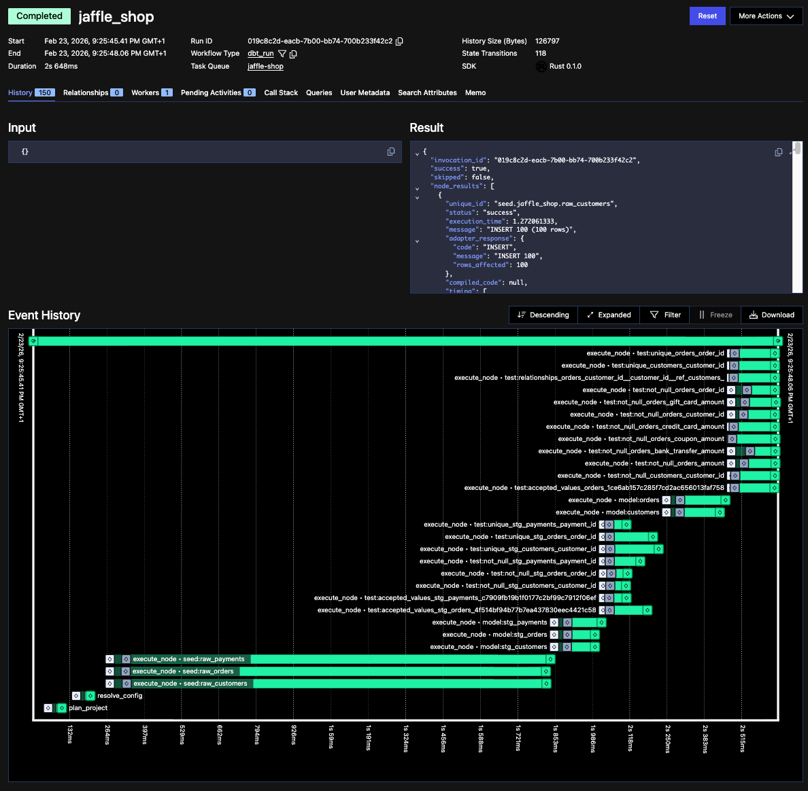
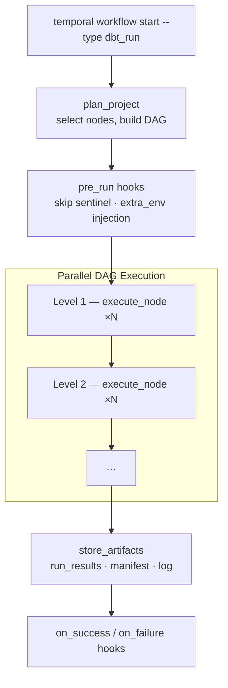

# dbt-temporal

Execute dbt DAGs as [Temporal](https://temporal.io/) Workflows. Each dbt node runs as a Temporal activity, giving you distributed execution, automatic retries, observability, and workflow management for free.



> **Status**: Not production-ready. dbt-temporal depends on
> [dbt-fusion](https://github.com/dbt-labs/dbt-fusion), which is in preview, and
> the [Temporal Rust SDK](https://github.com/temporalio/sdk-rust) (`0.1.0-alpha.1`),
> which is pre-1.0. Several
> [workarounds](docs/workarounds.md) are needed to make the dbt-fusion engine
> work in a long-lived worker context. This project will not be production-ready
> until at least dbt-fusion reaches GA (target: April 2026). Until then,
> consider this a proof of concept — perhaps it will always be just that, given
> it is largely developed by [Claude Code](https://claude.ai/claude-code) and
> there are no guarantees of code quality.

> **License**: dbt-temporal itself is [MIT-licensed](LICENSE). Its two main
> dependencies have their own licenses — see [THIRD-PARTY-LICENSES.md](THIRD-PARTY-LICENSES.md)
> for details. Notably, several dbt-fusion crates use the **Elastic License 2.0**,
> which restricts offering the software as a hosted service to third parties.



## Features

- **Parallel DAG execution** — nodes at each dependency level run concurrently as Temporal activities, with automatic retries for transient adapter errors
- **Multi-project** — load multiple dbt projects into one worker; select which to run per workflow invocation
- **Remote project sources** — fetch models from git repos (`git+https://`, `git+ssh://`), S3 (`s3://`), or GCS (`gs://`) at worker startup
- **Lifecycle hooks** — plug arbitrary Temporal workflows (in any language) at `pre_run`, `on_success`, and `on_failure` points for validation, notifications, catalog updates, or conditional execution
- **Per-workflow environment overrides** — each workflow can override `env_var()` values, including database connection settings, enabling parallel runs against different warehouses from a single worker
- **Artifact storage** — write `run_results.json`, `manifest.json`, and a CLI-style run log to local disk, S3, or GCS
- **Observability** — live node status in Temporal memos, per-node activity names in the Gantt chart, and custom search attributes for filtering
- **Worker tuning** — fixed concurrency caps or resource-based auto-scaling (cgroup-aware for containers), rate limiting, and graceful shutdown
- **Health checks** — built-in HTTP health server and exec-based liveness probe for Kubernetes

## Quick Start

```bash
# Start everything (Postgres, Temporal, workers, submit workflows)
make run-examples

# Or step by step:
make dev                        # Terminal 1: Temporal dev server (UI at http://localhost:8233)
make run-worker-single          # Terminal 2: start a worker
make submit-workflow-single     # Terminal 3: submit a workflow
```

## Workflow Input

```bash
temporal workflow start --type dbt_run --task-queue dbt-tasks --input '{
  "project": "my_project",
  "command": "run",
  "select": "+my_model",
  "exclude": "tag:wip",
  "target": "prod",
  "full_refresh": false,
  "fail_fast": true,
  "vars": {"key": "value"},
  "env": {"DB_SCHEMA": "prod_analytics"},
  "hooks": null
}'
```

All fields are optional. `command` defaults to `build`. `project` is auto-resolved when only one project is loaded.

## Documentation

| Document | Contents |
|----------|----------|
| [Configuration](docs/configuration.md) | Environment variables for Temporal, dbt projects, artifact storage, search attributes, health checks, and worker tuning |
| [Lifecycle Hooks](docs/hooks.md) | Hook events, configuration, error policies, fire-and-forget mode, skip sentinels, and extra_env injection |
| [Per-Workflow Env Overrides](docs/env-overrides.md) | How `env` overrides work for model SQL, macros, and database connections |
| [Error Handling](docs/error-handling.md) | Error classification, retry configuration, and non-retryable error patterns |
| [Architecture](docs/architecture.md) | Workflow execution flow, project structure, and dependency overview |
| [Deployment](docs/deployment.md) | Docker, Kubernetes, Cloud Run, ECS, and other deployment options |
| [dbt-fusion Workarounds](docs/workarounds.md) | Upstream issues and the workarounds in place |
| [Examples](examples/README.md) | Walkthrough of included example projects |

## Development

**Prerequisites**: Rust 1.85+, Docker + Docker Compose, a dbt project with a configured profile.

```bash
make run-examples       # one-command demo: Postgres + Temporal + workers + workflows
make test               # cargo test
make lint               # cargo fmt --check + cargo clippy
```

Integration tests use [testcontainers](https://rust.testcontainers.org/) to spin up Postgres and Temporal in Docker:

```bash
cargo test --test waffle_hut                    # end-to-end test
cargo test --features aws --test artifact_store_s3  # S3 artifact store against Minio
```

### Docker

```bash
docker build -f docker/Dockerfile -t dbt-temporal .
docker run -v ./my-project:/dbt/project -e TEMPORAL_ADDRESS=host.docker.internal:7233 dbt-temporal
```
