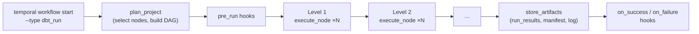

# dbt-temporal

Execute dbt DAGs as [Temporal](https://temporal.io/) Workflows. Each dbt node runs as a Temporal activity, enabling distributed execution, automatic retries, observability, and workflow management. [Lifecycle hooks](#lifecycle-hooks) let you plug arbitrary Temporal workflows into the pipeline — written in Python, Go, TypeScript, or any language with a Temporal SDK — for things like data validation, notifications, catalog updates, or conditional execution.


> **Status**: Not production-ready. dbt-temporal depends on
> [dbt-fusion](https://github.com/dbt-labs/dbt-fusion), which is in preview, and
> the [Temporal Rust SDK](https://github.com/temporalio/sdk-rust) (`0.3.0-beta`),
> which is pre-1.0 with frequent breaking changes. Several
> [workarounds](#dbt-fusion-workarounds) are needed to make the dbt-fusion engine
> work in a long-lived worker context. This project will not be production-ready
> until at least dbt-fusion reaches GA (target: April 2026). Until then,
> consider this a proof of concept — perhaps it will always be just that, given
> it is largely developed by [Claude Code](https://claude.ai/claude-code) and
> there are no guarantees of code quality.

> **License**: dbt-temporal itself is [MIT-licensed](LICENSE). Its two main
> dependencies have their own licenses — see [THIRD-PARTY-LICENSES.md](THIRD-PARTY-LICENSES.md)
> for details. Notably, several dbt-fusion crates use the **Elastic License 2.0**,
> which restricts offering the software as a hosted service to third parties.



## Table of Contents

- [Configuration](#configuration)
  - [Temporal Connection](#temporal-connection)
  - [dbt Project Discovery](#dbt-project-discovery)
  - [Remote Project Sources](#remote-project-sources)
  - [Artifact Storage](#artifact-storage)
  - [Run Log](#run-log)
  - [Search Attributes](#search-attributes)
  - [Health Check](#health-check)
  - [Worker Tuning](#worker-tuning)
- [Observability](#observability)
- [Development](#development)
- [Workflow Input](#workflow-input)
- [Lifecycle Hooks](#lifecycle-hooks)
- [Per-Workflow Environment Variables](#per-workflow-environment-variables)
- [Error Handling](#error-handling)

## Configuration

All configuration is via environment variables.

### Temporal Connection

| Variable | Default | Description |
|----------|---------|-------------|
| `TEMPORAL_ADDRESS` | `http://localhost:7233` | Temporal server address (URL with protocol) |
| `TEMPORAL_NAMESPACE` | `default` | Temporal namespace |
| `TEMPORAL_TASK_QUEUE` | `dbt-tasks` | Task queue name |
| `TEMPORAL_API_KEY` | - | API key for Temporal Cloud (sent as `Authorization: Bearer` header) |
| `TEMPORAL_TLS_CERT` | - | Path to client certificate PEM file (for mTLS) |
| `TEMPORAL_TLS_KEY` | - | Path to client private key PEM file (for mTLS) |

**Temporal Cloud**: Set `TEMPORAL_API_KEY` for API-key auth (recommended) or `TEMPORAL_TLS_CERT` + `TEMPORAL_TLS_KEY` for mTLS. TLS is enabled automatically when any of these are set. The address should be `<namespace>.<account>.tmprl.cloud:7233` and the namespace `<namespace>.<account>`.

### dbt Project Discovery

Projects are discovered using a fallback chain:

| Variable | Description |
|----------|-------------|
| `DBT_PROJECT_DIRS` | Comma-separated list of project sources (local paths or remote URLs) |
| `DBT_PROJECTS_DIR` | Base directory to scan for subdirs containing `dbt_project.yml` |
| `DBT_PROJECT_DIR` | Single project directory (legacy) |

If none are set, the current working directory is used (either as a project if it contains `dbt_project.yml`, or scanned for subdirs).

**Multi-project**: When multiple projects are loaded, specify which one to run via the `project` field in the workflow input. If only one project is loaded, it is auto-selected and `project` can be omitted. Each project gets its own adapter engine and parsed state — they are fully isolated. Duplicate project names (from `dbt_project.yml`) across sources are detected at startup and cause a fatal error.

| Variable | Default | Description |
|----------|---------|-------------|
| `DBT_PROFILES_DIR` | project dir | Path to profiles.yml |
| `DBT_TARGET` | from profile | Target override |
| `GITHUB_TOKEN` | - | Auth token for private git repos over HTTPS. Falls back to `GIT_TOKEN`. |

### Remote Project Sources

Entries in `DBT_PROJECT_DIRS` can be local filesystem paths or remote URLs. Paths without a protocol prefix are treated as local directories. Remote URLs are fetched at worker startup and scanned for `dbt_project.yml` files. Local and remote sources can be freely mixed.

**Supported URL schemes:**

| Scheme | Feature flag | Example |
|--------|-------------|---------|
| `git+https://` | none | `git+https://github.com/org/dbt-models.git#main` |
| `git+ssh://` | none | `git+ssh://git@github.com/org/dbt-models.git#main` |
| `gs://` | `gcs` | `gs://my-bucket/dbt-models` |
| `s3://` | `aws` | `s3://my-bucket/dbt-models` |

The `#branch` suffix is required for git URLs and specifies which branch (or tag) to check out. An optional `:subdir` can be appended to point at a subdirectory within the repo:

```
git+https://github.com/org/dbt-models.git#main:path/to/dbt
```

When a subdirectory is specified, only that path is scanned for `dbt_project.yml` files.

```bash
# Git (public repo)
DBT_PROJECT_DIRS=git+https://github.com/org/dbt-models.git#main cargo run

# Git (subdirectory — dbt project lives under path/to/dbt/)
DBT_PROJECT_DIRS=git+https://github.com/org/monorepo.git#main:path/to/dbt cargo run

# Git (private repo, GitHub Actions)
GITHUB_TOKEN=${{ secrets.GITHUB_TOKEN }} \
  DBT_PROJECT_DIRS=git+https://github.com/org/dbt-models.git#main cargo run

# S3
DBT_PROJECT_DIRS=s3://my-bucket/dbt-models cargo run --features aws

# Mix local + remote
DBT_PROJECT_DIRS=/local/analytics,git+https://github.com/org/shared-models.git#main cargo run
```

### Artifact Storage

| Variable | Default | Description |
|----------|---------|-------------|
| `WRITE_ARTIFACTS` | `false` | Enable artifact writing (`run_results.json`, `manifest.json`, `log.txt`) after each run |
| `ARTIFACT_STORE` | `/tmp/dbt-artifacts` | Local path or cloud URL (`gs://…`, `s3://…`). Cloud URLs require `gcs` or `aws` feature. |
| `WRITE_RUN_LOG` | `true` | Write a CLI-style run log (`log.txt`) to the artifact store alongside `run_results.json` |

`ARTIFACT_STORE` accepts the same URL schemes as `DBT_PROJECT_DIRS`:

| Scheme | Feature flag | Auth | Example |
|--------|-------------|------|---------|
| local path | none | — | `/data/dbt-artifacts` |
| `gs://` | `gcs` | Application Default Credentials | `gs://my-bucket/dbt-artifacts` |
| `s3://` | `aws` | `AWS_ACCESS_KEY_ID` / `AWS_SECRET_ACCESS_KEY` env vars | `s3://my-bucket/dbt-artifacts` |

```bash
# Local (default)
ARTIFACT_STORE=/data/dbt-artifacts cargo run

# GCS (uses ADC — no extra config needed on GCE/Cloud Run)
cargo build --features gcs
ARTIFACT_STORE=gs://my-bucket/dbt-artifacts cargo run

# S3 / Minio
cargo build --features aws
AWS_ACCESS_KEY_ID=... AWS_SECRET_ACCESS_KEY=... AWS_ENDPOINT=http://minio:9000 AWS_ALLOW_HTTP=true \
  ARTIFACT_STORE=s3://my-bucket/dbt-artifacts cargo run
```

### Run Log

When `WRITE_RUN_LOG` is enabled (the default), each workflow run writes a `log.txt` to the artifact store containing high-level, dbt-CLI-style output:

```
Running with dbt-temporal=0.1.0
Found 5 models, 3 tests, 2 seeds
Concurrency: 3 parallel levels

1 of 10 START table_model waffle_hut.stg_customers
2 of 10 START table_model waffle_hut.stg_orders
  => table_model waffle_hut.stg_customers  [OK in 1.23s]
  => table_model waffle_hut.stg_orders  [OK in 0.89s]
3 of 10 START view_model waffle_hut.customers
  => view_model waffle_hut.customers  [OK in 0.45s]
...

Finished running 10 nodes in 15.30s.
Done. PASS=8 ERROR=1 SKIP=1 TOTAL=10
```

The log path is returned in `DbtRunOutput.log_path` and `StoreArtifactsOutput.log_path`. Set `WRITE_RUN_LOG=false` to disable.

### Search Attributes

Workflows automatically upsert [Temporal search attributes](https://docs.temporal.io/visibility#search-attribute) for filtering and querying in the Temporal UI.

**Dynamic attributes** (set automatically from each workflow's input):

| Attribute | Description |
|-----------|-------------|
| `DbtProject` | Resolved project name |
| `DbtCommand` | `run` or `build` |
| `DbtTarget` | Target name (only if specified in workflow input) |

**Static attributes** can be added via the `TEMPORAL_SEARCH_ATTRIBUTES` env var — a JSON object of string key-value pairs applied to every workflow run by this worker:

```bash
export TEMPORAL_SEARCH_ATTRIBUTES='{"env":"prod","team":"data-eng"}'
```

Static values take precedence over dynamic ones if the same key is used.

> [!IMPORTANT]
> Search attributes must be [registered on the Temporal namespace](https://docs.temporal.io/visibility#custom-search-attributes) before they can be used. At startup the worker queries the namespace for registered attributes and **silently skips** any that are not registered — workflows will not fail, but unregistered attributes won't appear in the UI. Register them with:
> ```bash
> temporal operator search-attribute create --name DbtProject --type Keyword
> temporal operator search-attribute create --name DbtCommand --type Keyword
> temporal operator search-attribute create --name DbtTarget --type Keyword
> ```
> If the operator service is unreachable (e.g. some Temporal Cloud configurations), the worker logs a warning and skips all attribute upserts.

### Health Check

| Variable | Default | Description |
|----------|---------|-------------|
| `HEALTH_PORT` | - | Port for the built-in HTTP health server (`200 OK` when healthy, `503` when stale) |
| `HEALTH_FILE` | - | Path to the health file touched every 15s. Defaults to `/tmp/health` when `HEALTH_PORT` is set. |

**Healthcheck subcommand**: `dbt-temporal healthcheck` checks if the health file exists and was modified within the last 60 seconds. Exits `0` if healthy, `1` if stale. Designed for Kubernetes exec liveness probes (no curl/wget needed in the container image). Reads `HEALTH_FILE` (defaults to `/tmp/health`).

### Worker Tuning

Controls how many tasks the worker processes concurrently. Two modes are available, selected via the `WORKER_TUNER` env var.

**Fixed mode** (default) — simple concurrency caps:

| Variable | Default | Description |
|----------|---------|-------------|
| `WORKER_MAX_CONCURRENT_WORKFLOW_TASKS` | `200` | Max concurrent workflow tasks |
| `WORKER_MAX_CONCURRENT_ACTIVITIES` | `100` | Max concurrent activity tasks |
| `WORKER_MAX_CONCURRENT_LOCAL_ACTIVITIES` | `100` | Max concurrent local activity tasks |

**Resource-based mode** (`WORKER_TUNER=resource-based`) — dynamically adjusts slot availability using PID controllers that track system memory and CPU. The worker backs off when the machine is under pressure, preventing OOM kills and CPU starvation.

| Variable | Default | Description |
|----------|---------|-------------|
| `WORKER_RESOURCE_TARGET_MEM` | `0.8` | Target memory utilization (0.0–1.0). Slots are withheld above this threshold. |
| `WORKER_RESOURCE_TARGET_CPU` | `0.9` | Target CPU utilization (0.0–1.0). |
| `WORKER_RESOURCE_ACTIVITY_MIN_SLOTS` | `1` | Minimum activity slots issued regardless of resource pressure |
| `WORKER_RESOURCE_ACTIVITY_MAX_SLOTS` | `500` | Hard ceiling on concurrent activity slots |

The resource-based tuner is cgroup-aware: in containers with CPU/memory limits, it reads from `/sys/fs/cgroup` rather than host-level metrics.

**Polling, caching & timing** — applies to both modes:

| Variable | Default | Description |
|----------|---------|-------------|
| `WORKER_MAX_CACHED_WORKFLOWS` | `1000` | Number of workflows kept cached on sticky queues (LRU eviction). Higher values reduce replay overhead for concurrent workflows. |
| `WORKER_STICKY_QUEUE_TIMEOUT_SECS` | `10` | How long a workflow task can sit on the sticky queue before falling back to the normal (non-sticky) task queue. Lower values reduce latency on fallback at the cost of more replays. |
| `WORKER_NONSTICKY_TO_STICKY_POLL_RATIO` | `0.2` | Ratio of non-sticky to sticky queue pollers (0.0–1.0). Higher values make the worker poll the normal queue more aggressively, reducing fallback latency when sticky delivery fails. |

**Rate limiting & shutdown** — applies to both modes:

| Variable | Default | Description |
|----------|---------|-------------|
| `WORKER_MAX_ACTIVITIES_PER_SECOND` | unlimited | Per-worker rate limit on activities/second. Useful for protecting downstream warehouses from burst load. |
| `WORKER_MAX_TASK_QUEUE_ACTIVITIES_PER_SECOND` | unlimited | Server-side rate limit on activities/second for the entire task queue (across all workers). |
| `WORKER_GRACEFUL_SHUTDOWN_SECS` | none | Grace period (in seconds) before canceling in-flight activities on shutdown. Without this, the worker waits for all activities to complete. |

```bash
# Fixed: limit to 50 concurrent activities
WORKER_MAX_CONCURRENT_ACTIVITIES=50 cargo run

# Resource-based: auto-scale, back off at 70% memory
WORKER_TUNER=resource-based WORKER_RESOURCE_TARGET_MEM=0.7 cargo run

# Reduce sticky queue fallback latency
WORKER_STICKY_QUEUE_TIMEOUT_SECS=5 WORKER_NONSTICKY_TO_STICKY_POLL_RATIO=0.4 cargo run

# Rate-limit BigQuery API calls, graceful 30s shutdown
WORKER_MAX_ACTIVITIES_PER_SECOND=10 WORKER_GRACEFUL_SHUTDOWN_SECS=30 cargo run
```

## Observability

### Workflow Memos

The workflow stores live metadata in [Temporal memos](https://docs.temporal.io/workflows#memo), visible in the Temporal UI under the "Memo" tab:

| Memo key | Updated | Contents |
|----------|---------|----------|
| `command` | Once (at start) | Workflow input metadata: command, project, select, exclude, target, full_refresh, fail_fast, vars |
| `node_status` | After each DAG level | Map of `unique_id` → status (`pending`, `running`, `success`, `error`, `skipped`, `cancelled`) |
| `log` | After each DAG level | Tail of the CLI-style run log (last 200 lines) |

Both `node_status` and `log` are truncated to stay within Temporal memo size limits (2000 node entries, 200 log lines). The full run log is written to the artifact store at workflow completion.

### Per-Node Activity Types

Each dbt node is registered as a separate Temporal activity type named `<resource_type>:<node_name>` (e.g. `model:stg_customers`, `test:not_null_orders_id`, `seed:raw_orders`). These are aliases for the same `execute_node` handler, but they make the Temporal UI show descriptive activity names instead of a generic `execute_node` for every node.

## Development

### Prerequisites

- Rust 1.85+
- Docker + Docker Compose (for Temporal dev server)
- A dbt project with a configured profile

### Quick start

```bash
# Terminal 1: Start Temporal server + Postgres + UI
make dev

# Terminal 2: Start a worker (each example runs in its own namespace)
make run            # single-project example  → namespace: single-project
make run-multi      # multi-project example   → namespace: multi-project
make run-env        # env-override example    → namespace: env-override

# Terminal 3: Open the Temporal UI, then submit a workflow
make ui             # opens http://localhost:8233
make submit         # submits to single-project namespace
make submit-analytics   # submits analytics project  → multi-project namespace
make submit-marketing   # submits marketing project  → multi-project namespace
make submit-env     # submits to env-override namespace
```

Watch the workflow execute in the Temporal UI — switch to the matching namespace to see the plan phase, parallel node execution across DAG levels, and artifact storage.

### Makefile targets

| Target | Description |
|--------|-------------|
| `make dev` | Start Temporal dev server (gRPC :7233, UI :8233) |
| `make ui` | Open Temporal UI in browser (`http://localhost:8233`) |
| **Workers** | |
| `make run` | Start worker for `single-project` example |
| `make run-multi` | Start worker for `multi-project` example (analytics + marketing) |
| `make run-env` | Start worker for `env-override` example |
| **Submit workflows** | |
| `make submit` | Run all models in `single-project` |
| `make submit-analytics` | Run the `analytics` project (multi-project) |
| `make submit-marketing` | Build the `marketing` project (multi-project) |
| `make submit-env` | Run all models in `env-override` |

Each example runs in its own Temporal namespace (`single-project`, `multi-project`, `env-override`).

### Docker

```bash
docker build -f docker/Dockerfile -t dbt-temporal .

docker run \
  -v ./examples/single-project:/dbt/project \
  -e TEMPORAL_ADDRESS=host.docker.internal:7233 \
  dbt-temporal
```

### Tests

Integration tests use [testcontainers](https://rust.testcontainers.org/) to spin up infrastructure in Docker.

```bash
# Full end-to-end test (Postgres + Temporal ephemeral server + waffle_hut)
cargo test --test waffle_hut

# Artifact store tests against Minio (S3-compatible)
cargo test --features aws --test artifact_store_s3
```

## Workflow Input

```json
{
  "project": "waffle_hut",
  "command": "run",
  "select": "+my_model",
  "exclude": "tag:wip",
  "vars": {"key": "value"},
  "target": "prod",
  "full_refresh": false,
  "fail_fast": true,
  "hooks": null,
  "env": {}
}
```

All fields are optional. `command` defaults to `build` if omitted. `project` selects which loaded project to run — required when multiple projects are loaded, auto-resolved when only one is. `hooks` overrides the project-level `dbt_temporal.yml` defaults when set (see [Lifecycle Hooks](#lifecycle-hooks)). `env` provides per-workflow environment variable overrides (see [Per-Workflow Environment Variables](#per-workflow-environment-variables)).

## Lifecycle Hooks

Hooks let you run arbitrary Temporal workflows at specific points in the dbt run lifecycle. Each hook starts a child workflow, awaits its completion, and handles errors according to a configurable policy.

### Hook Events

| Event | Fires | Payload includes |
|-------|-------|------------------|
| `pre_run` | After planning, before the first node executes | `ExecutionPlan` + `DbtRunInput` |
| `on_success` | After all nodes succeed and artifacts are stored | Full `DbtRunOutput` |
| `on_failure` | After a failure, once artifacts are stored | Full `DbtRunOutput` (with errors) |

Each event supports multiple hooks, executed sequentially in list order.

### Configuration

Hooks can be configured in two ways:

**1. Project-level defaults** via `dbt_temporal.yml` (alongside `dbt_project.yml`):

```yaml
retry:
  max_attempts: 5
  non_retryable_errors:
    - "permission denied"

hooks:
  pre_run:
    - workflow_type: validate_permissions
      task_queue: auth-workers
      timeout_secs: 120
      on_error: fail

  on_success:
    - workflow_type: notify_pubsub
      task_queue: notifications
      on_error: warn
    - workflow_type: update_catalog
      task_queue: catalog
      on_error: warn

  on_failure:
    - workflow_type: alert_oncall
      task_queue: alerts
      on_error: warn
```

**2. Per-invocation overrides** via the workflow input `hooks` field:

```json
{
  "command": "run",
  "hooks": {
    "pre_run": [],
    "on_success": [
      {"workflow_type": "notify_pubsub", "task_queue": "notifications"}
    ],
    "on_failure": []
  }
}
```

If `hooks` is set in the workflow input, it fully replaces the file-based defaults. To suppress all hooks for a single run, pass empty arrays. If `hooks` is omitted, the `dbt_temporal.yml` defaults apply.

### Hook Config Fields

| Field | Required | Default | Description |
|-------|----------|---------|-------------|
| `workflow_type` | Yes | - | Temporal workflow type to start |
| `task_queue` | Yes | - | Task queue the hook worker listens on |
| `timeout_secs` | No | `300` | Execution timeout for the child workflow |
| `on_error` | No | `warn` | Error handling policy (see below) |
| `input` | No | - | Custom input payload (replaces `HookPayload`, see below) |
| `fire_and_forget` | No | `false` | Start the child workflow without awaiting its result |

### Error Handling Policies

| Policy | Behavior |
|--------|----------|
| `fail` | **pre_run**: abort the dbt run. **on_success/on_failure**: flip `success` to `false` in the output. |
| `warn` | Log a warning, continue to the next hook. Error is recorded in `DbtRunOutput.hook_errors`. |
| `ignore` | Swallow the error silently. |

### Hook Payload

By default, every hook workflow receives a single JSON input (`HookPayload`):

```json
{
  "event": "on_success",
  "invocation_id": "workflow-run-id",
  "input": { "command": "run", "select": "+marts", ... },
  "plan": { "levels": [...], "nodes": {...}, ... },
  "output": { "success": true, "node_results": [...], ... }
}
```

- `plan` is available for all events.
- `output` is only set for `on_success` and `on_failure`.

The hook workflow can be written in any language with a Temporal SDK — Rust, Python, Go, TypeScript, etc. It just needs to be registered on the specified task queue.

### Custom Input

When a hook sets the `input` field, that value is sent as the child workflow input instead of `HookPayload`. This lets hooks start any workflow type — including `dbt_run` itself — with the native input format:

```yaml
hooks:
  pre_run:
    - workflow_type: dbt_run
      task_queue: dbt-tasks
      timeout_secs: 120
      on_error: fail
      input:
        command: run
        select: customers
        hooks: {}   # Empty hooks prevent recursive hook execution
```

The `hooks: {}` override is important when starting `dbt_run` as a hook — without it, the child workflow would inherit the project's `dbt_temporal.yml` defaults and trigger hooks recursively.

### Fire-and-Forget Mode

When `fire_and_forget: true`, the hook child workflow is started but not awaited. The parent workflow continues immediately without waiting for the hook to complete. The child workflow runs independently with `ParentClosePolicy: Abandon`, meaning it will keep running even if the parent workflow completes, fails, or is cancelled.

```yaml
hooks:
  on_success:
    - workflow_type: notify_slack
      task_queue: notifications
      fire_and_forget: true
      on_error: warn
```

Error handling for fire-and-forget hooks only applies to the *start* phase — if the child workflow fails to start, `on_error` determines the behavior. Once started, failures in the child workflow are not reported back to the parent.

Fire-and-forget hooks cannot return skip sentinels (since their result is never read).

### Skip Sentinel (Pre-Run Hooks)

A `pre_run` hook can signal that the dbt run should be skipped entirely by returning a skip sentinel value. When a skip is detected, the workflow returns early with `success: true`, `skipped: true`, and no node results. Remaining hooks in the list are not executed.

Skip sentinel values (returned as the hook workflow's result):

| Return value | Effect |
|-------------|--------|
| `false` | Skip with no reason |
| `{"skip": true}` | Skip with no reason |
| `{"skip": true, "reason": "not ready"}` | Skip with a reason string |
| `{"skip": false}` | Continue (no skip) |
| Anything else | Continue (no skip) |

The skip reason (if provided) is included in `DbtRunOutput.skip_reason`. This is useful for conditional execution — e.g. a pre-hook that checks whether source data has changed and skips the run if nothing is new.

### Extra Env (Pre-Run Hooks)

A `pre_run` hook can inject environment variables into the dbt run by returning an `extra_env` map:

```json
{"extra_env": {"SNOWFLAKE_ACCOUNT": "org-myaccount", "DB_SCHEMA": "prod_2026_02"}}
```

These are merged with the workflow's `env` field (hook values take precedence) and forwarded to every `execute_node` activity. They are available via `{{ env_var('KEY') }}` in model SQL and macros, and — when `profiles.yml` uses `env_var()` — also drive per-workflow adapter engine rebuilding, so the hook can control the database connection.

`extra_env` and skip sentinels can coexist in the same return value. If a skip is detected, `extra_env` is irrelevant (no nodes run). Values must be strings; non-string values are silently ignored.

**Example: hook resolves account credentials at runtime**

```python
# Python Temporal worker
@workflow.defn
class ResolveCredentialsWorkflow:
    @workflow.run
    async def run(self, payload: dict) -> dict:
        account = await workflow.execute_activity(
            fetch_account_for_run,
            payload["input"],
            start_to_close_timeout=timedelta(seconds=30),
        )
        return {
            "extra_env": {
                "SNOWFLAKE_ACCOUNT": account["snowflake_account"],
                "DB_SCHEMA": account["schema"],
            }
        }
```

```yaml
# dbt_temporal.yml
hooks:
  pre_run:
    - workflow_type: resolve_credentials
      task_queue: auth-workers
      on_error: fail
```

```yaml
# profiles.yml — env_var() here triggers per-workflow adapter rebuilding
my_profile:
  outputs:
    prod:
      type: snowflake
      account: "{{ env_var('SNOWFLAKE_ACCOUNT') }}"
      schema: "{{ env_var('DB_SCHEMA', 'public') }}"
```

### Limitations

- Hooks run as **child workflows** in the same Temporal namespace. Cross-namespace hooks are not yet supported (the Rust SDK doesn't expose a namespace field on `ChildWorkflowOptions`).

## Per-Workflow Environment Variables

Each workflow can provide its own environment variable overrides via the `env` field. These override `env_var()` calls in model SQL, macros, and (when profiles.yml uses `env_var()`) database connection configuration. Parallel workflows are fully isolated — no shared process-level state.

```bash
temporal workflow start \
  --type dbt_run \
  --task-queue dbt-tasks \
  --input '{
    "command": "run",
    "env": {
      "DB_HOST": "warehouse-a.example.com",
      "DB_SCHEMA": "analytics_team_a",
      "DB_PASSWORD": "secret-a"
    }
  }'
```

### How it works

1. **Model SQL / macros**: Each `execute_node` activity clones the shared Jinja environment and re-registers `env_var()` with a closure that checks the workflow's env map before falling back to process-level env vars. This means `{{ env_var('MY_SCHEMA') }}` in a model will resolve to the workflow's override if present.

2. **Database connections**: At worker startup, profiles.yml is scanned for `env_var()` usage. If detected and a workflow provides `env` overrides, the profile is re-rendered with the workflow's env map and a fresh adapter engine (database connection) is built per workflow. If profiles.yml does not use `env_var()`, this step is skipped and the shared adapter engine is used.

3. **Fallback**: Any env var not present in the workflow's `env` map falls through to the process environment. This means you only need to override the variables that differ between workflows.

### Example: profiles.yml with env_var()

```yaml
my_profile:
  target: dev
  outputs:
    dev:
      type: postgres
      host: "{{ env_var('DB_HOST', 'localhost') }}"
      port: "{{ env_var('DB_PORT', '5432') }}"
      user: "{{ env_var('DB_USER', 'postgres') }}"
      password: "{{ env_var('DB_PASSWORD', 'postgres') }}"
      dbname: "{{ env_var('DB_NAME', 'analytics') }}"
      schema: "{{ env_var('DB_SCHEMA', 'public') }}"
      threads: 4
```

With this profile, two parallel workflows can target different databases:

```bash
# Workflow A: writes to warehouse-a / schema analytics_a
temporal workflow start --type dbt_run --input '{
  "command": "run",
  "env": {"DB_HOST": "warehouse-a", "DB_SCHEMA": "analytics_a"}
}'

# Workflow B: writes to warehouse-b / schema analytics_b
temporal workflow start --type dbt_run --input '{
  "command": "run",
  "env": {"DB_HOST": "warehouse-b", "DB_SCHEMA": "analytics_b"}
}'
```

Both workflows run on the same worker, share the parsed project state (DAG, macros, compiled SQL templates), but each gets its own database connection and env_var resolution.

### When the adapter engine is rebuilt

The per-workflow adapter engine rebuild only happens when **both** conditions are true:

1. `profiles.yml` contains `env_var(` (detected once at worker startup)
2. The workflow's `env` field is non-empty

If either condition is false, the shared adapter engine from worker startup is used with zero overhead.

### Known limitations

Per-workflow env overrides work fully for `env_var()` in **profiles.yml**, **model SQL**, and **macros**. The common pattern of setting schema/dataset and database/project in profiles.yml via `env_var()` is fully supported — each workflow gets its own connection, `target` context, and relation metadata. Static custom schemas (e.g. `+schema: staging` in `dbt_project.yml` or `config(schema='staging')` in SQL) are also correctly recomputed against the per-workflow target.

Edge cases with limited support:

- **`config(schema=env_var(...))` in model SQL**: If a model uses `env_var()` inside its in-file `config()` block to set the custom schema name (not in profiles.yml or dbt_project.yml), that value is evaluated once at worker startup and baked into node metadata. Per-workflow overrides for that env var will not change the custom schema. This is an unusual pattern — the standard approach is `env_var()` in profiles.yml (fully supported) or static `+schema` in dbt_project.yml (fully supported).

- **Custom `generate_schema_name` macros**: Schema patching follows the default dbt convention (`target.schema` for no custom, `target.schema_custom` for custom schemas). Projects with a `generate_schema_name` override that uses a different naming pattern may not get correct context-variable patching. The `target` Jinja global is always correct, so materializations and macros that read `target.schema` directly will work.

## Error Handling

| Error Type | Retryable? | Examples |
|-----------|-----------|----------|
| `Compilation` | No | Bad SQL, missing ref, Jinja render failure |
| `Configuration` | No | Missing profile, bad config, invalid selector |
| `Adapter` | Yes | Connection timeout, rate limit, transient DB error |
| `TestFailure` | No | A dbt test query returned failing rows (data won't change on retry) |
| `ProjectNotFound` | No | Worker doesn't have the requested project loaded |

### Retry Configuration

The `execute_node` activity retries transient adapter errors with exponential backoff. Defaults can be overridden in `dbt_temporal.yml`:

```yaml
retry:
  max_attempts: 3            # total attempts (1 = no retries)
  initial_interval_secs: 5   # first backoff delay
  backoff_coefficient: 2.0   # multiplier for successive backoffs
  max_interval_secs: 60      # upper bound on backoff delay
  non_retryable_errors:       # regex patterns — matching adapter errors won't be retried
    - "permission denied"
    - "relation .* does not exist"
    - "access denied"
```

All fields are optional and default to the values shown above (except `non_retryable_errors` which defaults to empty). The `non_retryable_errors` patterns are matched against the full adapter error message — if any pattern matches, the error is treated as non-retryable regardless of its type.

## dbt-fusion Workarounds

dbt-temporal uses [dbt-fusion](https://github.com/dbt-labs/dbt-fusion) (Rust) as its rendering and execution engine. The crates are designed for the dbt CLI's single-invocation model, not for a long-lived worker that runs multiple workflows concurrently. Several workarounds are in place to bridge this gap.

### 1. `RunConfig` missing `call()` — `{{ config(...) }}` no-op during execution

**Issue:** [dbt-labs/dbt-fusion#1290](https://github.com/dbt-labs/dbt-fusion/issues/1290)

Model SQL frequently contains `{{ config(materialized='table') }}`. During the run phase this should be a silent no-op (the config was already parsed), but `RunConfig` only implements `call_method()` — not `call()` — so minijinja errors when invoking config as a function.

**Workaround:** Before compiling raw SQL, we swap the `config` context variable to a `NoopConfig` object that implements both `call()` and `call_method("get",...)`. After compilation, we restore `RunConfig` so materialization macros can still use `config.get()`.

### 2. `execute` not set as Jinja global

**Issue:** [dbt-labs/dbt-fusion#1289](https://github.com/dbt-labs/dbt-fusion/issues/1289)

`execute` is only set as a context variable in `build_compile_and_run_base_context()`, not as a Jinja global. Cross-template macros (like `statement()` in `statement.sql`) resolve variables from globals, not the caller's render context — so they see `execute` as undefined and skip SQL execution.

**Workaround:** We call `jinja_env.env.add_global("execute", true)` before rendering.

### 3. `ResultStore` not injectable into context builders

**Issue:** [dbt-labs/dbt-fusion#1291](https://github.com/dbt-labs/dbt-fusion/issues/1291)

`build_compile_and_run_base_context()` and `extend_base_context_stateful_fn()` each create their own `ResultStore` and inject its closures (`store_result`, `load_result`, `store_raw_result`) into the context. Callers that need to read adapter responses after materialization must use their own `ResultStore`, but the context builders overwrite its closures.

**Workaround:** We create our `ResultStore` upfront, let the context builders overwrite the closures, then re-inject our store's closures into both the context and Jinja globals. Three stores are allocated per node; two are immediately discarded.

### 4. `ref()` resolves schemas at parse time, not execution time

`ref()` calls are resolved during project parsing and baked into `Relation` objects with the startup default schema. When a per-workflow env override changes `DB_SCHEMA`, downstream models still reference the old schema in their compiled SQL (e.g. `"waffle_hut"."default_schema"."stg_customers"` instead of `"waffle_hut"."override_schema"."stg_customers"`).

**Workaround:** After Jinja renders the raw SQL, we string-replace quoted occurrences of the startup default schema with the per-workflow schema in the compiled SQL. This is brittle — it assumes the schema appears as a quoted identifier and that no column or alias happens to match the schema name.

### Other temporary hacks

| Workaround | Description |
|-----------|-------------|
| **ADBC PostgreSQL driver built from source** | The CDN-shipped driver uses `-undefined dynamic_lookup`, leaving OpenSSL/libpq symbols unresolved. On macOS ARM64 this causes SIGSEGV at `dlopen` time. We [build from source](scripts/build-adbc-postgres.sh) with statically linked OpenSSL/libpq. See [docs/adbc-postgres-macos-segfault.md](docs/adbc-postgres-macos-segfault.md) and [dbt-fusion#31](https://github.com/dbt-labs/dbt-fusion/issues/31). |
| **Telemetry compatibility layer** | dbt-fusion's adapter code expects `TelemetryAttributes` in span extensions (normally inserted by `TelemetryDataLayer`). Without it, `record_current_span_status_from_attrs` panics. We insert a default `TelemetryAttributes` for every span via [`DbtTelemetryCompatLayer`](src/telemetry_compat.rs). |
| **Forked arrow-rs / arrow-adbc / ring** | dbt-fusion uses forked versions of `arrow-rs` (v56, sdf-labs fork), `arrow-adbc` (dbt-labs fork), and `ring` (sdf-labs fork). Without matching `[patch.crates-io]` entries, version conflicts prevent compilation. See `Cargo.toml`. |
| **Ephemeral CTE injection** | Ephemeral models are excluded from the execution plan. We detect `__dbt__cte__` references in compiled SQL and recursively compile + inline the ephemeral models as CTEs. |

## Further Reading

- [Architecture](docs/architecture.md) — workflow execution flow, project structure, and dependency overview
- [Deployment](docs/deployment.md) — Docker, Kubernetes, Cloud Run, ECS, and other deployment options
