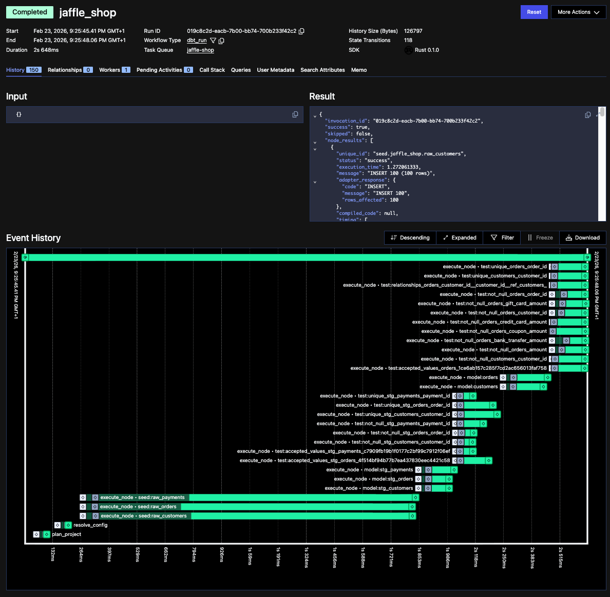
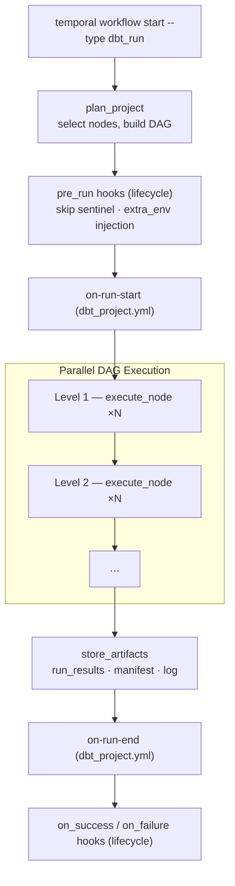

# dbt-temporal

Execute dbt DAGs as [Temporal](https://temporal.io/) Workflows. Each dbt node runs as a Temporal activity, giving you distributed execution, automatic retries, observability, and workflow management for free.



> **Status**: Not production-ready. dbt-temporal depends on the dbt Fusion engine,
> now developed in [dbt-core](https://github.com/dbt-labs/dbt-core) as dbt Core v2,
> pinned to a 2026-09-06 `main` revision (`2.0.0-rc.1`), and the
> [Temporal Rust SDK](https://github.com/temporalio/sdk-rust) (`1.0.0`). Several
> [workarounds](docs/workarounds.md) are needed to make the Fusion engine work in
> a long-lived worker context. Consider this a proof of concept — largely
> developed by [Claude Code](https://claude.ai/claude-code) with no guarantees of
> code quality.

> **License**: dbt-temporal itself is [MIT-licensed](LICENSE). Its two main
> dependencies are permissively licensed as well — dbt Core v2 is **Apache 2.0**
> and the Temporal Rust SDK is **MIT**. See
> [THIRD-PARTY-LICENSES.md](THIRD-PARTY-LICENSES.md) for details.


```mermaid
flowchart TD
    Start["temporal workflow start --type dbt_run"] --> Plan
    Plan["plan_project\nselect nodes, build DAG"] --> PreHooks
    PreHooks["pre_run hooks (lifecycle)\nskip sentinel · extra_env injection"] --> OnStart
    OnStart["on-run-start (dbt_project.yml)"] --> L1

    subgraph DAG["Parallel DAG Execution"]
        L1["Level 1 — execute_node ×N"] --> L2["Level 2 — execute_node ×N"]
        L2 --> LN["…"]
    end

    LN --> Store["store_artifacts\nrun_results · manifest · log"]
    Store --> OnEnd["on-run-end (dbt_project.yml)"]
    OnEnd --> PostHooks["on_success / on_failure hooks (lifecycle)"]
```

## Features

- **Parallel DAG execution** — nodes at each dependency level run concurrently as Temporal activities, with automatic retries for transient adapter errors
- **Multi-project** — load multiple dbt projects into one worker; select which to run per workflow invocation
- **Multi-adapter targets** — a profile target may declare several adapters; the worker builds one engine per declared adapter and routes each node by its `+adapter` selection, falling back to the target's default. A node naming an undeclared adapter fails permanently rather than running against the wrong warehouse
- **Remote project sources** — fetch models from git repos (`git+https://`, `git+ssh://`), S3 (`s3://`), or GCS (`gs://`) at worker startup
- **Full dbt hook parity** — `on-run-start` / `on-run-end` from `dbt_project.yml` (with the standard `results` context), per-model `pre-hook` / `post-hook`, plus dbt-temporal-native lifecycle hooks (`pre_run` / `on_success` / `on_failure`) that plug arbitrary Temporal workflows in any language for validation, notifications, catalog updates, or conditional execution
- **store_failures & catalog.json** — test `store_failures` persists failing rows to the audit schema (created on demand); `WRITE_CATALOG=1` adds a partial `catalog.json` (warehouse column metadata) to each run's artifacts
- **Freshness checks** — `source-freshness` measures sources; `freshness` also measures models that declare a freshness SLA. Each node's freshness query (`loaded_at_field` or `loaded_at_query`) runs as its own activity with no ordering between them, `warn_after`/`error_after` are evaluated per node, a node past `error_after` fails the run, and the results are written to `sources.json` (plus `freshness.json` for the unified command)
- **Project checks** — SQL under `check-paths` (`checks/` by default) queries the project's own metadata (`dbt.models`, `dbt.checks`, …) and gates the build. Checks are evaluated after planning and before any hook fires, so a project that fails its gate performs no side effects; `warn` severity reports and proceeds, and a check that cannot execute is an error whatever its severity
- **dbt unit tests** — `unit_tests:` definitions run as activities in `dbt build`, executing the model's SQL against `given` fixtures (dict/CSV/SQL, inline or fixture files) and comparing to `expect` rows order-insensitively; a unit test runs before its model and a failure skips the model and everything downstream
- **Selector coverage** — 20 of dbt's 24 selector methods are evaluated, with dbt's own glob rules. Methods that need artifacts this worker does not have (`result:`, `source_status:`) are rejected by name rather than silently matching nothing. See [selector semantics](docs/selector-semantics.md)
- **Per-workflow environment overrides** — each workflow can override `env_var()` values, including database connection settings, enabling parallel runs against different warehouses from a single worker
- **Artifact storage** — write `run_results.json`, `manifest.json`, and a CLI-style run log to local disk, S3, or GCS
- **Observability** — live node status in Temporal memos, per-node activity names in the Gantt chart, and custom search attributes for filtering
- **Worker tuning** — fixed concurrency caps or resource-based auto-scaling (cgroup-aware for containers), rate limiting, and graceful shutdown
- **Health checks** — built-in HTTP health server and exec-based liveness probe for Kubernetes

## Installation

Tagged releases (`v*`) publish Debian/RHEL packages and a container image via
GitHub Actions.

```bash
# From source with cargo (works with the git dependencies this crate uses):
cargo install --git https://github.com/thejens/dbt-temporal --locked

# Or pull a container image from GHCR (both glibc, so ADBC drivers load):
docker pull ghcr.io/thejens/dbt-temporal:latest         # debian-slim (has a shell)
docker pull ghcr.io/thejens/dbt-temporal:distroless     # distroless/cc (minimal)

# Or install a distro package from the latest GitHub Release
# (https://github.com/thejens/dbt-temporal/releases):
sudo apt install ./dbt-temporal_<version>_amd64.deb        # Debian/Ubuntu
sudo dnf install ./dbt-temporal-<version>-1.x86_64.rpm     # RHEL/Alma/Rocky 8+
```

> **Not on crates.io.** dbt-temporal depends on the unpublished dbt-core (Fusion)
> crates via git and a `[patch.crates-io]` block for forked `arrow-rs`/`ring`.
> `cargo publish` rejects both, so the crate is distributed via `cargo install
> --git`, GHCR, and release binaries rather than `cargo install dbt-temporal`.

## Quick Start

```bash
# Start everything (Postgres, Temporal, workers, submit workflows)
make run-examples

# Or step by step:
make dev                        # Terminal 1: Temporal dev server (UI at http://localhost:8233)
make run-worker-single          # Terminal 2: start a worker
make submit-workflow-single     # Terminal 3: submit a workflow
```

## Workflow Input

```bash
temporal workflow start --type dbt_run --task-queue dbt-tasks --input '{
  "project": "my_project",
  "command": "run",
  "select": "+my_model",
  "exclude": "tag:wip",
  "target": "prod",
  "full_refresh": false,
  "fail_fast": true,
  "vars": {"key": "value"},
  "env": {"DB_SCHEMA": "prod_analytics"},
  "hooks": null
}'
```

All fields are optional. `command` defaults to `build`; `run`, `test`, `seed`, `snapshot`, `compile`, `list`, `source-freshness`, and `freshness` are also supported. `project` is auto-resolved when only one project is loaded. `resource_types` / `exclude_resource_types` narrow any plan to (or away from) named resource types, the `--resource-type` / `--exclude-resource-type` equivalents.

dbt Core v2 **functions** (scalar UDFs) are executed: `build`, `compile` and `list` schedule them like any other buildable node. Whether a function actually creates depends on the adapter — dbt ships generic `CREATE OR REPLACE FUNCTION` SQL that Postgres, Snowflake, BigQuery and Databricks accept. Adapters without it (DuckDB, for one) need a project-level `<adapter>__scalar_function_sql` override, the same dispatch hook dbt uses everywhere else.

The two freshness commands differ in what they measure. `source-freshness` covers sources only. `freshness` covers sources **plus** models that declare an SLA — a `freshness:` config block with `warn_after` and/or `error_after`. A model's `build_after` is deliberately not an SLA: it is a scheduling rule for state-aware builds, so a `build_after`-only model is never measured. Neither command builds anything; both need a `loaded_at_field` or `loaded_at_query` on every node they measure (dbt's relation-metadata fallback needs an adapter metadata interface the worker does not drive, so nodes that declare a rule without either are skipped and named in a warning). A rule naming `count` without `period`, or the reverse, aborts the plan rather than reading as "no rule".

Exposures, metrics, saved queries and semantic models are parsed into the graph but have no execution path — they are excluded from every plan, and a `build` over a project containing them logs a warning naming the excluded resource types.

`vars` and `full_refresh` apply per workflow: `vars` layer over the project's own (CLI-vars precedence, so a key you don't pass keeps its `dbt_project.yml` value), and `full_refresh` surfaces as `flags.FULL_REFRESH` / `flags.full_refresh`, which is what dbt's `should_full_refresh()` and `is_incremental()` read. One limit is worth knowing: the worker parses each project **once at startup**, so `var()` calls evaluated during parsing — inside `{{ config(...) }}` blocks or `dbt_project.yml` — keep their startup value. Only render-time `var()` (model bodies, macros, hooks) reflects the workflow's vars. The planner warns and names the nodes when it spots a run's vars inside a `config()` block. The same startup-parse constraint is why `config(schema=env_var(...))` is rejected outright.

Additional inputs: `defer_manifest_ref` (defer unbuilt refs to a previous manifest, `--defer --state` equivalent), `event_time_start`/`event_time_end` (microbatch window), `retry_from` — point it at a previous run's `run_results.json` artifact to re-run only the nodes that did not succeed (the `dbt retry` equivalent; start it with the same `select`/`exclude` as the original run) — and `state_manifest_ref`, which enables the `state:` select methods (`modified`, `new`, `old`, `unmodified`) against a previous `manifest.json` artifact (the `--state` equivalent; slim CI pattern: `"select": "state:modified+", "state_manifest_ref": "<prod manifest>"`, often combined with `defer_manifest_ref` pointing at the same manifest).

While a run executes, query live progress and toggle fail-fast without restarting:

```bash
temporal workflow query -w <workflow-id> --type run_status
temporal workflow update execute -w <workflow-id> --name set_fail_fast -i true
```

## Documentation

| Document | Contents |
|----------|----------|
| [Configuration](docs/configuration.md) | Environment variables for Temporal, dbt projects, artifact storage, search attributes, health checks, and worker tuning |
| [Lifecycle Hooks](docs/hooks.md) | Hook events, configuration, error policies, fire-and-forget mode, skip sentinels, and extra_env injection |
| [Per-Workflow Env Overrides](docs/env-overrides.md) | How `env` overrides work for model SQL, macros, and database connections |
| [Error Handling](docs/error-handling.md) | Error classification, retry configuration, and non-retryable error patterns |
| [Architecture](docs/architecture.md) | Workflow execution flow, project structure, and dependency overview |
| [Deployment](docs/deployment.md) | Docker, Kubernetes, Cloud Run, ECS, and other deployment options |
| [dbt-fusion Workarounds](docs/workarounds.md) | Upstream issues and the workarounds in place |
| [Examples](examples/README.md) | Walkthrough of included example projects |

## Development

**Prerequisites**: Rust 1.85+, Docker + Docker Compose, a dbt project with a configured profile.

```bash
make run-examples       # one-command demo: Postgres + Temporal + workers + workflows
make test               # cargo test
make lint               # cargo fmt --check + cargo clippy
```

Integration tests use [testcontainers](https://rust.testcontainers.org/) to spin up Postgres and Temporal in Docker:

```bash
cargo test --test waffle_hut                    # end-to-end test
cargo test --features aws --test artifact_store_s3  # S3 artifact store against Minio
```

### Docker

```bash
docker build -f docker/Dockerfile -t dbt-temporal .
docker run -v ./my-project:/dbt/project -e TEMPORAL_ADDRESS=host.docker.internal:7233 dbt-temporal
```
