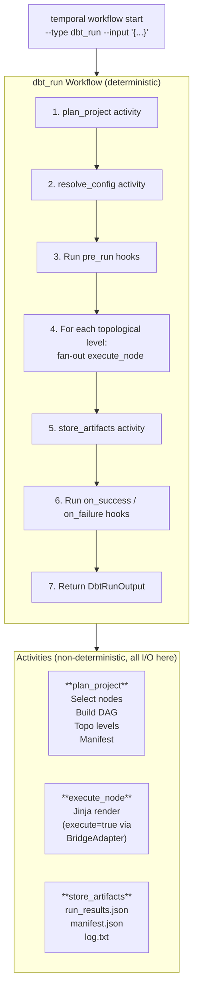

# Architecture

**Key insight**: dbt node execution IS Jinja rendering with `execute=true`. Materialization macros (table, view, incremental) generate DDL/DML. The `BridgeAdapter` routes Jinja `adapter.*` calls to the real warehouse.

## How It Works

1. **Worker startup**: Optionally fetches dbt projects from a remote model store (git repo or cloud storage). Then loads one or more dbt projects (dbt-loader -> dbt-parser -> adapter engine per project) into a `ProjectRegistry`. Each project gets its own `WorkerState` with isolated adapter connections.

2. **`plan_project` activity**: Applies `--select`/`--exclude` filters, builds topological levels from the DAG, and serializes the manifest.

3. **`execute_node` activity** (per node, per level): Clones the Jinja environment, configures it for the run phase with `execute=true`, renders the node's materialization template. The rendering itself triggers SQL execution through the BridgeAdapter.

4. **`store_artifacts` activity**: Writes `run_results.json`, `manifest.json`, and optionally `log.txt` (a CLI-style run log) to the configured artifact store (local filesystem or GCS/S3).

Parallel execution is natural: all nodes in the same topological level are independent, so Temporal dispatches them as concurrent activities.

## Project Structure

| File | Description |
|------|-------------|
| [`src/main.rs`](../src/main.rs) | Worker binary entry point |
| [`src/lib.rs`](../src/lib.rs) | Re-exports |
| [`src/error.rs`](../src/error.rs) | `DbtTemporalError` → `ActivityError` mapping |
| [`src/worker_state.rs`](../src/worker_state.rs) | `WorkerState` (holds parsed project) |
| [`src/project_registry.rs`](../src/project_registry.rs) | Multi-project registry + lookup |
| [`src/hooks.rs`](../src/hooks.rs) | Lifecycle hooks (child workflows) |
| [`src/health.rs`](../src/health.rs) | Health file tracker + HTTP health server |
| **Config** (`src/config/`) | |
| [`mod.rs`](../src/config/mod.rs) | `DbtTemporalConfig`, `WorkerTuningConfig` (from env vars) |
| [`discovery.rs`](../src/config/discovery.rs) | Project directory discovery + remote source detection |
| [`tuning.rs`](../src/config/tuning.rs) | Search attribute + worker tuning env var parsing |
| **Types** (`src/types/`) | |
| [`workflow.rs`](../src/types/workflow.rs) | Serializable workflow I/O types (`DbtRunInput`, `DbtRunOutput`, `ExecutionPlan`, …) |
| [`hooks.rs`](../src/types/hooks.rs) | Hook and retry config types (`HooksConfig`, `RetryConfig`, …) |
| **Worker** (`src/worker/`) | |
| [`mod.rs`](../src/worker/mod.rs) | `build_worker`, `run_worker`, project initialization, Temporal registration |
| [`adapter.rs`](../src/worker/adapter.rs) | `build_adapter_engine`, `build_artifact_store` |
| [`profile.rs`](../src/worker/profile.rs) | `rebuild_adapter_engine_with_env` (per-workflow env overrides) |
| [`temporal.rs`](../src/worker/temporal.rs) | TLS options + worker config construction |
| **Workflow** (`src/workflow/`) | |
| [`mod.rs`](../src/workflow/mod.rs) | `dbt_run_workflow` |
| [`helpers.rs`](../src/workflow/helpers.rs) | Node status tree, retry policy, log helpers |
| **Activities** (`src/activities/`) | |
| [`plan.rs`](../src/activities/plan.rs) | `plan_project` — select nodes, build DAG levels, serialize manifest |
| [`execute_node.rs`](../src/activities/execute_node.rs) | `execute_node` — compile + render a single node |
| [`node_helpers.rs`](../src/activities/node_helpers.rs) | Materialization template lookup + rendering helpers |
| [`store_artifacts.rs`](../src/activities/store_artifacts.rs) | `store_artifacts` — write run results + manifest |
| **Artifact Store** (`src/artifact_store/`) | |
| [`mod.rs`](../src/artifact_store/mod.rs) | `ArtifactStore` trait |
| [`local.rs`](../src/artifact_store/local.rs) | Local filesystem backend |
| [`object_store_backend.rs`](../src/artifact_store/object_store_backend.rs) | GCS/S3 via `object_store` (feature-gated) |
| **Model Store** (`src/model_store/`) | |
| [`mod.rs`](../src/model_store/mod.rs) | `fetch_models` entry point |
| [`git.rs`](../src/model_store/git.rs) | Git clone backend |
| [`object_store_backend.rs`](../src/model_store/object_store_backend.rs) | GCS/S3 download backend (feature-gated) |

## Dependencies

| Dependency | Status | Role |
|------------|--------|------|
| [Temporal Rust SDK](https://github.com/temporalio/sdk-core) | Pre-alpha | Workflow orchestration |
| [dbt-fusion](https://github.com/dbt-labs/dbt-fusion) | Pre-alpha | Project loading, parsing, DAG construction, Jinja rendering, adapter execution |
