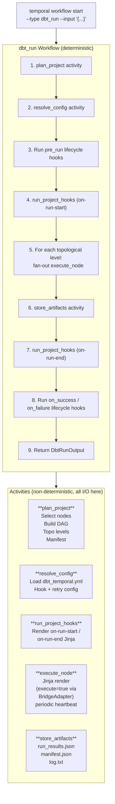

# Architecture

```mermaid
flowchart TD
    User["temporal workflow start\n--type dbt_run --input '{...}'"] --> Workflow

    subgraph Workflow["dbt_run Workflow (deterministic)"]
        direction TB
        W1["1. plan_project activity"] --> W2["2. resolve_config activity"]
        W2 --> W3["3. Run pre_run lifecycle hooks"]
        W3 --> W4["4. run_project_hooks (on-run-start)"]
        W4 --> W5["5. For each topological level:\n   fan-out execute_node"]
        W5 --> W6["6. store_artifacts activity"]
        W6 --> W7["7. run_project_hooks (on-run-end)"]
        W7 --> W8["8. Run on_success / on_failure lifecycle hooks"]
        W8 --> W9["9. Return DbtRunOutput"]
    end

    Workflow --> Activities

    subgraph Activities["Activities (non-deterministic, all I/O here)"]
        direction LR
        Plan["**plan_project**\nSelect nodes\nBuild DAG\nTopo levels\nManifest"]
        Config["**resolve_config**\nLoad dbt_temporal.yml\nHook + retry config"]
        Hooks["**run_project_hooks**\nRender on-run-start /\non-run-end Jinja"]
        Exec["**execute_node**\nJinja render\n(execute=true via\nBridgeAdapter)\nperiodic heartbeat"]
        Store["**store_artifacts**\nrun_results.json\nmanifest.json\nlog.txt"]
    end
```

**Key insight**: dbt node execution IS Jinja rendering with `execute=true`. Materialization macros (table, view, incremental) generate DDL/DML. The `BridgeAdapter` routes Jinja `adapter.*` calls to the real warehouse.

## How It Works

1. **Worker startup**: Optionally fetches dbt projects from a remote model store (git repo or cloud storage). Then loads one or more dbt projects (dbt-loader -> dbt-parser -> adapter engine per project) into a `ProjectRegistry`. Each project gets its own `WorkerState` with isolated adapter connections.

2. **`plan_project` activity**: Applies `--select`/`--exclude` filters, builds topological levels from the DAG, and serializes the manifest.

3. **`resolve_config` activity**: Loads `dbt_temporal.yml` from the project directory (if present) and returns the resolved hook and retry configuration for this run.

4. **`run_project_hooks` activity (`on-run-start`)**: If `dbt_project.yml` declares `on-run-start`, render those Jinja templates against the full compile+run context (with `execute=true` and per-workflow env overrides applied). Failure aborts the run before any node executes.

5. **`execute_node` activity** (per node, per level): Clones the Jinja environment, configures it for the run phase with `execute=true`, renders the node's materialization template. The rendering itself triggers SQL execution through the BridgeAdapter. A periodic heartbeat ticker runs alongside the work so the Temporal UI's last-heartbeat stays current and dead workers are detected within `heartbeat_timeout`.

6. **`store_artifacts` activity**: Writes `run_results.json`, `manifest.json`, and optionally `log.txt` (a CLI-style run log) to the configured artifact store (local filesystem or GCS/S3).

7. **`run_project_hooks` activity (`on-run-end`)**: Always fires (even after failure), with the standard `results` Jinja list populated from `node_results`. Errors are recorded in `DbtRunOutput.hook_errors` but do not flip the run's success status.

Parallel execution is natural: all nodes in the same topological level are independent, so Temporal dispatches them as concurrent activities.

## Project Structure

| File | Description |
|------|-------------|
| [`src/main.rs`](../src/main.rs) | Worker binary entry point |
| [`src/lib.rs`](../src/lib.rs) | Re-exports |
| [`src/error.rs`](../src/error.rs) | `DbtTemporalError` → `ActivityError` mapping |
| [`src/worker_state.rs`](../src/worker_state.rs) | `WorkerState` (holds parsed project) |
| [`src/project_registry.rs`](../src/project_registry.rs) | Multi-project registry + lookup |
| [`src/hooks.rs`](../src/hooks.rs) | Lifecycle hooks (child workflows) |
| [`src/health.rs`](../src/health.rs) | Health file tracker + HTTP health server |
| [`src/telemetry_compat.rs`](../src/telemetry_compat.rs) | Tracing layer that injects `TelemetryAttributes` into every span (dbt-fusion compatibility) |
| **Config** (`src/config/`) | |
| [`mod.rs`](../src/config/mod.rs) | `DbtTemporalConfig`, `WorkerTuningConfig` (from env vars) |
| [`discovery.rs`](../src/config/discovery.rs) | Project directory discovery + remote source detection |
| [`tuning.rs`](../src/config/tuning.rs) | Search attribute + worker tuning env var parsing |
| **Types** (`src/types/`) | |
| [`workflow.rs`](../src/types/workflow.rs) | Serializable workflow I/O types (`DbtRunInput`, `DbtRunOutput`, `ExecutionPlan`, …) |
| [`hooks.rs`](../src/types/hooks.rs) | Hook and retry config types (`HooksConfig`, `RetryConfig`, …) |
| **Worker** (`src/worker/`) | |
| [`mod.rs`](../src/worker/mod.rs) | `build_worker`, `run_worker`, project initialization, Temporal registration |
| [`adapter.rs`](../src/worker/adapter.rs) | `build_adapter_engine`, `build_artifact_store` |
| [`profile.rs`](../src/worker/profile.rs) | `rebuild_adapter_engine_with_env` (per-workflow env overrides) |
| [`temporal.rs`](../src/worker/temporal.rs) | TLS options + worker config construction |
| **Workflow** (`src/workflow/`) | |
| [`mod.rs`](../src/workflow/mod.rs) | `dbt_run_workflow` |
| [`helpers.rs`](../src/workflow/helpers.rs) | Node status tree, retry policy, log helpers |
| **Activities** (`src/activities/`) | |
| [`mod.rs`](../src/activities/mod.rs) | `DbtActivities` — `Arc<Self>` shared state, `#[activities]` registration |
| [`plan.rs`](../src/activities/plan.rs) | `plan_project` — select nodes, build DAG levels, serialize manifest |
| [`execute_node.rs`](../src/activities/execute_node.rs) | `execute_node` — compile + render a single node |
| [`project_hooks.rs`](../src/activities/project_hooks.rs) | `run_project_hooks` — render `on-run-start` / `on-run-end` from `dbt_project.yml` |
| [`store_artifacts.rs`](../src/activities/store_artifacts.rs) | `store_artifacts` — write run results + manifest |
| [`heartbeat.rs`](../src/activities/heartbeat.rs) | Periodic `record_heartbeat` ticker for long-running activities |
| [`node_helpers.rs`](../src/activities/node_helpers.rs) | Materialization template lookup + rendering helpers |
| [`node_serialization.rs`](../src/activities/node_serialization.rs) | Serialization helpers for passing nodes across activity boundaries |
| [`dag.rs`](../src/activities/dag.rs) | DAG construction and topological level computation |
| [`selectors.rs`](../src/activities/selectors.rs) | Node selector evaluation (`--select` / `--exclude`) |
| **Artifact Store** (`src/artifact_store/`) | |
| [`mod.rs`](../src/artifact_store/mod.rs) | `ArtifactStore` trait |
| [`local.rs`](../src/artifact_store/local.rs) | Local filesystem backend |
| [`object_store_backend.rs`](../src/artifact_store/object_store_backend.rs) | GCS/S3 via `object_store` (feature-gated) |
| **Model Store** (`src/model_store/`) | |
| [`mod.rs`](../src/model_store/mod.rs) | `fetch_models` entry point |
| [`git.rs`](../src/model_store/git.rs) | Git clone backend |
| [`object_store_backend.rs`](../src/model_store/object_store_backend.rs) | GCS/S3 download backend (feature-gated) |

## Dependencies

| Dependency | Status | Role |
|------------|--------|------|
| [Temporal Rust SDK](https://github.com/temporalio/sdk-core) | `0.3.0` | Workflow orchestration |
| [dbt-fusion](https://github.com/dbt-labs/dbt-fusion) | Git rev `00969f9` (2026-04-25 `main`) | Project loading, parsing, DAG construction, Jinja rendering, adapter execution |
